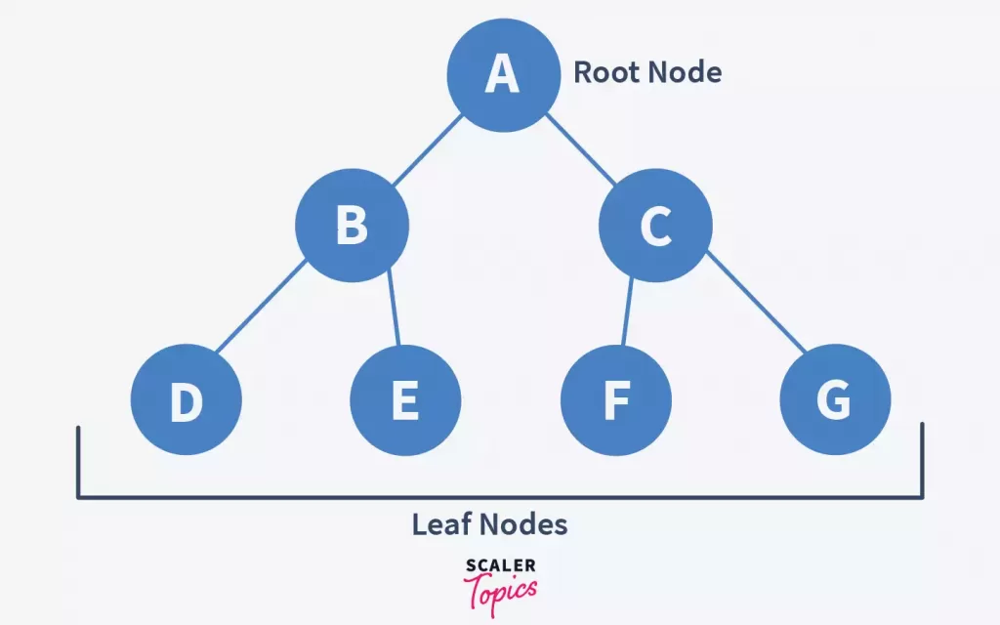

## Pre-lecture Content

### What are Binary Trees?
```text
Imagine that your college is going to organize a fest, and you 
are given the responsibility of managing the entire event. Would 
you do all the work on your own or are you likely to divide the 
entire team into smaller parts and assign a task to each one of 
them? In this case, the second option seems to be a better 
one. You can divide the team into smaller teams like 
sponsorship, technical, etc., and each team can have a leader 
who would instruct the other members of the team.

Notice that doing this would create a hierarchical structure 
where you are the person at the top, then at the second level 
you have team leaders, and at the third level, each team has 
some volunteers. This is what trees are! There is only one element 
at the top, and each element has some children and grandchildren.

A binary tree is a tree data structure(we shall add a link to 
the tree article here) whose all nodes have either zero, one, 
or at most two children nodes. These two children are generally 
referred to as left and right child respectively.

The top-most node is known as the root node, while the nodes with 
no children are known as leaf nodes.
```

### Terminologies in Binary Trees
```text
1. Nodes - Nodes are the building blocks of any data structure. They 
   majorly contain some data and link to the next/previous nodes. In 
   the case of binary trees, they contain the address of the left 
   and the right child respectively.

2. Root - The topmost node in a tree is known as the root node. A 
   tree can have at most one root node.

3. Parent Node - A node (except the root) that has a succeeding 
   node is known as a parent node.

4. Child Node - A node that has a preceding node is known as a 
    child node. A node can be both parent and child depending on 
    the node that is in context.

5. Leaf Node - A node with no children.

6. Internal Node - A node that has at least one child node is 
   known as an internal node.

7. Depth of a Binary Tree - The number of edges from a node in 
   the tree to the root node.

8. Height of a Binary Tree - The number of edges from the 
   deepest node in the tree to the root node.
```

## Post-lecture Content
### Implementation of Binary Trees
* 1. Binary Tree Program in Java
```java
// Binary Tree in Java

// creating a node that holds the data, address of the left child, and the address of the right child
class Node {
    int key;
    Node left, right;

    //setting data in the node
    public Node(int item) {
        key = item;
        //setting left and right child equal to NULL
        left = right = null;
    }
}

class BinaryTree {
    Node root;
    //inserting data into the binary tree
    BinaryTree(int key) {
        root = new Node(key);
    }

    //set root NULL when the binary tree is created for the first time
    BinaryTree() {
        root = null;
    }

    public static void main(String[] args) {

        //creating a new instance of Binary Tree
        BinaryTree tree = new BinaryTree();

        //inserting into the binary tree
        tree.root = new Node(1);
        tree.root.left = new Node(2);
        tree.root.right = new Node(3);
    }
}
```
* 2Binary Tree Program in C++
```cpp
 // Binary Tree in C++
//structure that contains data, address of left child, address of the right child
struct Node {
 int data;
 struct node *left;
 struct node *right;
};
 
// function to create a new node
Node *newNode(int data) {
 //allocating space for the node
 Node *node = new Node;
 
 //storing in the data
 node->data = data;
  //setting left and right children to NULL
 node->left = NULL;
 node->right = NULL;
 return (node);
}
```

