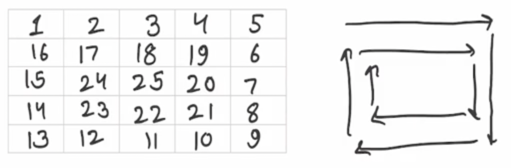

### Q2. Spiral Order Matrix II
#### Problem Description
<p>
    Given an integer <strong>A</strong>, generate a square 
    matrix filled with elements from 1 to A<sup>2</sup> in spiral 
    order and return the generated square matrix.
</p>

```text
Given an integer A, generate a square matrix filled with 
elements from 1 to A^2 in spiral order and return 
the generated square matrix.
```
#### Problem Constraints
```text
1 <= A <= 1000
```
#### Input Format
```text
First and only argument is integer A
```
#### Output Format
```text
Return a 2-D matrix which consists of the elements added in spiral order.
```
#### Example Input
```text
Input 1:
 1

Input 2:
 2

Input 3:
 5
```
#### Example Output
```text
Output 1:
 [ [1] ]

Output 2:
 [ [1, 2], [4, 3] ]
Output 2:
 [ [1, 2, 3, 4, 5], 
   [16, 17, 18, 19, 6], 
   [15, 24, 25, 20, 7], 
   [14, 23, 22, 21, 8], 
   [13, 12, 11, 10, 9] 
 ]
```
#### Example Explanation
```text
Explanation 1:
    Only 1 is to be arranged.

Explanation 2:
    1 --> 2
          |
          |
    4<--- 3
```
#### Explanation 3:


### Hints
* Hint 1
```text
This is more of a simulation problem.

Try to figure out when to change direction and when to 
terminate the algorithm.
```
* Solution Approach
```text
This is more of a simulation problem.

You need to maintain a state indicating which direction you 
are traversing to ( left to right, right to left, top to 
down, down to top ) and then know when to change the directions.

Note that in each direction, either row or column remains constant.

Based on the constant row or column, you can predict when 
to change the direction.

Time Complexity : O(A^2)
```
* Complete Solution
* * Solution in Java
```java
public class Solution {
    public ArrayList<ArrayList<Integer>> generateMatrix(int A) {
        ArrayList<ArrayList<Integer>> res = new ArrayList<>();
	    int rows, cols;
	    int row, col;
	    rows = cols = A;
	    int num = 1;
	    int max = A * A;
	    for (int i = 0; i < rows; i++) {
	        res.add(new ArrayList<>());
	        for (int j = 0; j < rows; j++) {
	            res.get(i).add(0);
	        }
	    }
	    row = col = 0;
	    int dir = 0;
	    int layer = 0;
	    res.get(0).set(0, 1);
	    for (int step = 2; step <= A * A; step++) {
	        switch(dir) {
	            // Go right
	            case 0:
	                if (col == cols - layer - 1) {
	                    row++;
	                    dir = 1;
	                } 
	                else
	                    col++;
	                break;
	           // Go down     
	           case 1:
	               if (row == rows - layer - 1) {
	                   dir = 2;
	                   col--;
	               } else
	                   row++;
	               break;
	           // Go left    
	           case 2:
	               if (col == layer) {
	                   row--;
	                   dir = 3;
	               } else
	                   col--;
	               break;
	           // Go up    
	           case 3:
	               if (row == layer + 1) {
	                   dir = 0;
	                   col++;
	                   layer++;
	               } else
	                   row--;
	               break;
	        }
	        res.get(row).set(col, step);
	    }
	    return res;
	}
}
```
* * Solution in Javascript
```javascript
module.exports = {
    //param A : integer
    //return a array of array of integers
    generateMatrix: function (A) {
        let n = A;
        let dir = 0;
        let matrix = [...Array(A)].map(() => Array(A).fill(0));
        let i = 0, j = 0, k = 1;
        while (k <= n * n) {
            matrix[i][j] = k++;
            if (dir == 0) {
                // move right
                j++;
                if (j == n || matrix[i][j] != 0) (dir = 1), j--, i++;
            } else if (dir == 1) {
                // move down
                i++;
                if (i == n || matrix[i][j] != 0) (dir = 2), i--, j--;
            } else if (dir == 2) {
                // move left
                j--;
                if (j < 0 || matrix[i][j] != 0) (dir = 3), j++, i--;
            } else if (dir == 3) {
                // move up
                i--;
                if (i < 0 || matrix[i][j] != 0) (dir = 0), i++, j++;
            }
        }
        return matrix;
    },
};
```
* * Solution in C++
```cpp
vector<vector<int> > Solution::generateMatrix(int A) {
    int n = A;
    int dir = 0;
    vector< vector<int> > matrix(n, vector<int> (n, 0));
    int i = 0, j = 0, k = 1;
    while (k <= n * n) {
        matrix[i][j] = k++;
        if (dir == 0){
            // move right
            j++;
            if (j == n || matrix[i][j] != 0) 
                dir = 1, j--, i++;
        } 
        else if (dir == 1) {
            // move down
            i++;
            if (i == n || matrix[i][j] != 0) 
                dir = 2, i--, j--;
        } 
        else if (dir == 2) {
            // move left
            j--;
            if (j < 0 || matrix[i][j] != 0) 
                dir = 3, j++, i--;
        } 
        else if (dir == 3) {
            // move up
            i--;
            if (i < 0 || matrix[i][j] != 0) 
                dir = 0, i++, j++;
        }
    }
    return matrix;
}
```

