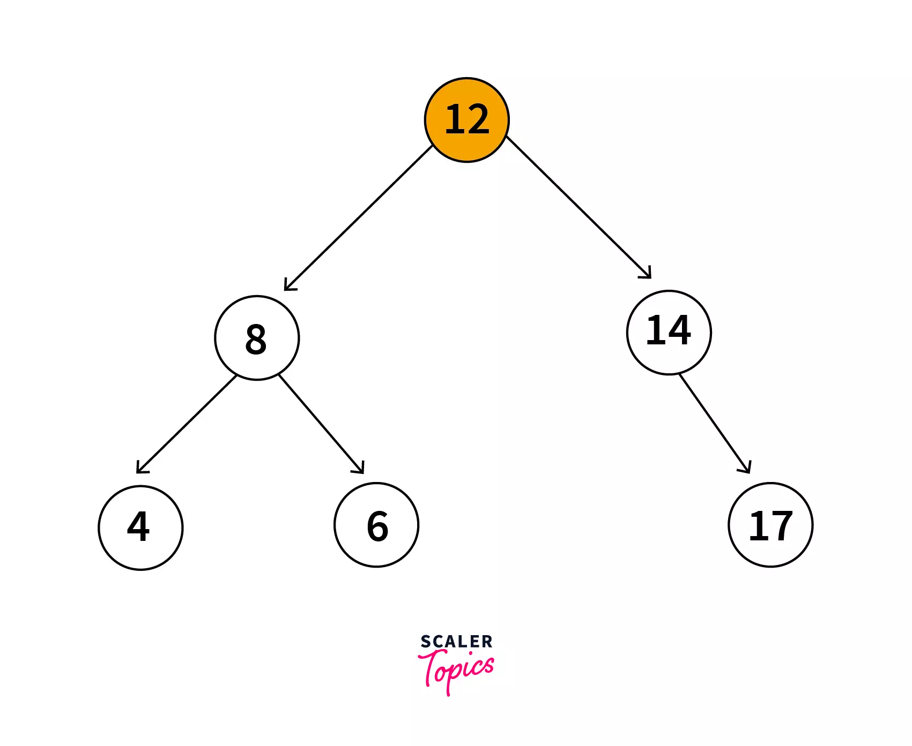

## Tree Data Structure
### Overview
```text
A tree data structure is a non-linear data structure because it does not 
store in a sequential manner. It is a hierarchical structure as 
elements in a Tree are arranged in multiple levels.
```
### Introduction
```text
We all are familiar with trees in real life, aren’t we? It’s fascinating 
to know that with the observation of leaves and branches of a tree, 
one came up with a structure to store and organize data in the 
real world which now is widely being used in multiple 
application libraries and has really changed the world.

Well, coming back to a tree. Observing one, we can conclude 
that a tree has leaves, branches, roots and stems. If observed 
more carefully, each leaf, following it’s stems and branches, 
when traced, can take us to its roots.

In real life, this fine observation can be used to structure a basic 
family history in the form of the hierarchy where leaves can be 
considered as children and tracing leaf with it’s stems and branches 
can lead to its earliest known roots i.e. parents to grandparents to 
earliest known grandparents.
```

```text
In the above example, considering each person as a leaf node OR each couple 
with children as a leaf node, it's easy to trace parents of each leaf by tracing 
the hierarchy determining lines (can be related to stems and branches in real life).

Hence the above family tree looks pretty familiar with the following 
upside down tree, and that is where this data structure gets its name from.
```
### What is Tree Data Structure?

#### Let's understand some key points of the Tree data structure.

* A tree data structure is defined as a collection of objects or entities known 
as nodes that are linked together to represent a hierarchy.
* It's a non linear data structure as it does not store data in a 
sequential manner, but stores in a hierarchical fashion.
* In the Tree data structure, the first node is known as a root node i.e. from 
which the tree originates. Each node contains some data and also contains 
references to child nodes. A root node can never have a parent node.

### Tree Data Structure Terminologies

```text
Tree is a hierarchical data structure that is defined as a collection of nodes. 
In a tree nodes represent the values and are connected by edges. Following are 
the terminologies and properties of a tree:
```
| Terminology    | Description                                                                                                                                                                | Diagram                                                                                                                                                              |
|----------------|----------------------------------------------------------------------------------------------------------------------------------------------------------------------------|----------------------------------------------------------------------------------------------------------------------------------------------------------------------|
| Root           | Root node is a node from which the entire tree originates. It does not have a parent                                                                                       | Node A                                                                                                                                                               |
| Parent Node    | An immediate predecessor of any node is its parent node.                                                                                                                   | B is parent of E & F                                                                                                                                                 |
| Child Node     | All immediate successors of a node are its children. The relationship between the parent and child is considered as the parent-child relationship.                         | F & E are children of B                                                                                                                                              |
| Leaf           | Node which does not have any child is a leaf. Usually the boundary nodes of a tree or last nodes of the tree are the leaf or collectively called leaves of the tree.       | E, F, J, K, H, I are the leaf nodes.                                                                                                                                 |
| Edge           | Edge is the connection represented by a line between one node to another.In a tree with n nodes, there will be ‘n-1’ edges in a tree.                                      | Connecting line between A&B OR A&C OR B&F OR any other nodes connecting each other.                                                                                  |
| Siblings       | Siblings in real life means people with the same parents, similarly in the case of trees, nodes with common parents are considered to be siblings.                         | H&I are siblings                                                                                                                                                     |
| Path           | Path is a number of successive edges from source node to destination node.                                                                                                 | A ,C, G, K is path from node A to K                                                                                                                                  |
| Height of Node | Height of a node represents the number of edges on the longest path between that node and a leaf.                                                                          | A, C, G, K form a height. Height of A is no. of edges between A and K,, which is 3. Similarly the height of G is 1 as it has just one edge until the next leaf node. |
| Levels of node | Level of a node represents the generation of a node. If the root node is at level 0, then its next child node is at level 1, its grandchild is at level 2, and so on       | Level of H, I & J is 3. Level of D, E, F & G is 2                                                                                                                    |
| Degree of Node | Degree of a node implies the number of child nodes a node has.                                                                                                             | Degree of D is 2 and of C is 3                                                                                                                                       |
| Visiting       | When you’ve iterated or traversed to a specific node programmatically, accessing value or checking value of the current node is called visiting.                           |                                                                                                                                                                      |
| Internal Node  | A node that has at least one child is known as an internal node.                                                                                                           | All the nodes except E, F, J, K, H, I are internal.                                                                                                                  |
| Traversing     | Traversing is a process of visiting each node in a specific order in a tree data structure.                                                                                | There are three types of traversals: inorder, preorder, postorder traversal.                                                                                         |
| Ancestor node  | An ancestor or ancestors to a node are all the predecessor nodes from root until that node. I.e. any parent or grandparent and so on of a specific node are its ancestors. | A, C & G are ancestor to K and J nodes                                                                                                                               |
| Descendant     | Immediate successor of a node is its descendent.                                                                                                                           | K is descendent of G                                                                                                                                                 |
| Sub tree       | Descendants of a node represent subtree. Tree being a recursive data structure can contain many subtrees inside of it.                                                     | Nodes B, E, F represent one subtree.                                                                                                                                 |                                                                                                                                                                   |                         |

### Properties of Trees in Data Structure
```text
Recursive Data Structure: a recursive method is the one that calls itself. 
Similarly a recursive data structure is the one that contains itself. 
A tree can be viewed as a recursive data structure, as even though 
a tree has only one root node, each node acts as a root node to 
another sub-tree. For example:

Following is a tree that has ‘A’ as the root node. 
Similarly if we look at ‘C’ node, that is another tree in itself. 
And the tree no 3 i.e. that starts with ‘D’ node is also a tree in itself.
```


```text
And that is how a tree contains multiple trees in itself, and this proves 
that it's a recursive data structure as a recursive data structure contains itself.
```
#### Note
* **Note:** Even the leaf nodes are a tree in itself i.e. they can be seen from a 
perspective as trees without any child nodes.

```text
Number of edges: If there are ‘n’ nodes in a tree then there would be  n−1 edges. 
Each edge is the line-arrow connecting two nodes.

Depth of node x: Depth of a specific node x is defined as the length 
from root till this x node. One edge contributes to one unit in the length. 
Hence depth of a node x can also be considered as the number of nodes 
from root node till this x node.

Or depth of a node x can also be considered as the level L at which this 
node is, and adding 1 to it i.e. 

depth = L + 1. It is because the first level starts with 0.

Height of node x: Height of a node represents the number of edges on the 
longest path between that node and a leaf.
```
### Implementation of Tree in Data Structure


```text
The above representation depicts what a tree looks like on a memory. 
According to it, each node consists of three fields.

Left part of the node consists of the memory address of the left child, 
the right part of the node consists of the memory address 
of the right child and the center part holds the data for this node.

Relating to the above representation, each node can be programmatically 
defined as a class as follows:
``` 
```java
public class Node {
    public int value;
    public Node left;
    public Node right;
}
```
```text
Here left will contain the reference to the Node that has value which is just 
smaller to the value in the current Node. Similarly right will contain 
reference to the Node that has value greater than the current Node.

What we’re discussing here is in reference to a binary tree as a binary tree 
has two children (utmost). That means, either a node has 0, 1 or max 2 children. 
A generic tree can have more than 2 children as well.
```
### Applications of Trees in Data Structure
* **Traversing:** One of the best examples for traversing is DocumentObjectModel. 
With such a structure, it becomes simpler to “traverse” through the tree in 
order for the programmers to access related nodes.

It allows access to all siblings of a currently selected node. 
The tree structure becomes a route for the html interpreter that can be 
followed to traverse throughout the HTML document.


* **Search:** As a tree is a hierarchical data structure, each node is connected 
to another node, hence it allows it to reach a specific data node easily 
and efficiently. Consider a binary search tree, which is a more refined 
version of a tree as each node has at most 2 child 
nodes(a left node and a right node). A left node will contain data that is 
less than the data in the current node and right node will contain data 
greater than data than the current node.

Hence a specific data is easy to search in a binary search tree. 
Even though a binary search tree allows efficient searching, extra effort 
that is required to create a binary search tree shall also be considered.
As the time complexity of searching an element in 
the binary search tree is O(H), where H is the height of the tree, 
that not only makes searching efficient but also makes insertion and deletion 
possible at any node in the tree.
Hence organising data in a tree also becomes feasible with efficient 
insertion and deletion at any node.

* **Decision Making:** Picture tree as a structure where each node depicts a decision made by the user. Each node provides us with two choices and as the user chooses one, it moves down the tree with one step. As we reach a leaf, we reach a final decision. Hence all the flows in any application can all be picturised in a tree as each and every flow is defined and there are not infinite flows in an application (unless they’re circular).

For example the following diagram represents multiple decisions that a user has to make while selecting a movie. Hence, flows to reach a movie that a user wants to watch are very limited. From the client’s side or the user’s perspective this may not seem like the same construct. But from the application’s program/code’s perspective there is some tree-like data structure that is following a similar construct as below.

Hence a tree data structure can provide us with an algorithm that can allow a user to explore movie streaming applications in such a way that they can reach a movie that might be best recommended for them.


But if the application had a feature to automatically show the user a 
movie that is best recommended for them to watch, is there a possibility 
for the program to automatically find a new movie that the user has 
never watched and with a maximum probability that the user 
will like it? This brings us to our next application.

* **Machine Learning:** Well, for a machine to automatically make a decision for the user, the machine would require a lot of historical data and data trends about the user’s manual selection of data such that the machine adapts to the choices of the user’s past choices.

Assuming we have such data, we give the machine access to a tree data structure, history data sets, allow it to keep stats or data sets of its own to understand data trends (in this case user’s choice of movies) and somehow let it come with data for each node.

Assuming that there is a program that runs the algorithm using tree data structure inorder to reach a conclusion (in this case a movie) based on data sets provided.

Initially the data structure will begin with whatever data is provided to it, but as the program will iterate through each and every data, it will reach wrong conclusions many times. But once the program has reached a significant amount of iterations, its tendency to reach a wrong conclusion will decrease as now the program will also have statistics of its own (like what category the user watches the most, what kind of movies the user usually skips or not finishes etc).

Based on these data trends and stats, the tree data structure will allow the program to flow to the right conclusion or in this case a perfect movie for the user. It's all about the data in the nodes of the trees, if the program gathers the right data trends and statistics and if the data is correctly used in the nodes of the tree data structure, if the algorithm to decide what the next child node should be is appropriate, then the program will flow to the right conclusion most of the times.

#### Note:
```text
Above are just some explanations that will allow you to relate a tree 
data structure to real life scenarios and it's just a very high level 
idea as to how tree data structure can be applied in machine 
learning or decision making or organising files in a machine. 
It's a very brief and surface level analogy for you to relate to 
some real life features with this data structure.
```
### Types Of Trees in Data Structure
* **General tree:** In the general tree, each node has either 0 or n number of nodes. In this tree, there is no limitation to the number of nodes. It starts with a root node and the children of the parent node make another general sub tree. Hence eachnode is a root of another sub-tree i.e. there can be `n number of subtrees in a general tree. All the subtrees are unordered in a general tree.


* Binary Tree: In a binary tree, each node can have at most 2 children (i.e. either 0, 1, 2). There is no restriction as to what data will be in the left child or right child.


* **Binary Search Tree:** A binary search tree just like a binary tree can have at most 2 children. It can have n nodes and also each node can be defined as a data part that holds the data, left child and the right node.
  <br> Left child holds reference to the node that contains data which is immediately lesser than the data in the current node and similarly the right child contains the reference to the node that contains data which is just greater than the data in the current node.

Every node in the left subtree must contain a value less than the value of the root node, and the value of each node in the right subtree must be bigger than the value of the root node. Relating to the above representation, a node can be programmatically defined as:

```java
class Node {
    public int value;
    public Node left;
    public Node right; 
}
```


* **AVL Tree:** It can be considered as a binary tree and also a type of binary search tree. It satisfies features of both binary tree and binary search tree.
  <br> It's a self balancing tree i.e. balancing heights of left subtree and right subtree. This balancing is measured by something called balancing factor.
  <br> A tree is considered as an AVL tree if it satisfies properties of both a binary search tree and the balancing factor. Difference between the height of the left subtree and the right subtree is considered as the height of the AVL tree.The value of the balancing factor must be 0, 1 or -1 for each node in an AVL tree.

* **Red Black Tree:** It is also a variant of a binary search tree. It's also a self balancing tree just like an AVL tree, the only difference is in an AVL tree, we do not have an idea as to how much rotations would be required to balance the tree but in a red black tree a maximum of two rotations are required to balance the tree. It contains a bit that represents the red or black color of the node to ensure the balancing of the tree.
  And there are and can be more types of tree data structure, but these are the common tree data structures that one must know about.

### Conclusion

* A tree data structure is defined as a collection of objects or entities known as nodes that are linked together to represent a hierarchy.
* A tree is recursive in nature as it is a recursive data structure. It is so because each tree contains multiple subtrees, as each node in a tree is a root node to another tree that makes it a subtree.
* A tree has multiple applications like:
* * **Traversing:** that allows us or a program to traverse through an object model like DocumentObjectModel.
* * **Searching:** in a structure like a binary search tree, it's easier to search for an element as smaller elements are located in the left subtree and greater elements are located in the right subtree.
* * **Decision Making:** A flow of an application can be represented in a hierarchical structure that allows us to understand all the decisions that a user can make.
* * **Machine Learning:** Machine learning allows us to make automatic decision making framework that was made possible with tree data structure.


