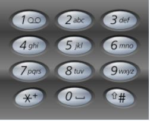

### Q2. Letter Phone
#### Problem Description
```text
Given a digit string A, return all possible letter combinations that the number 
could represent.

A mapping of digit to letters (just like on the telephone buttons) is given below.
```



```text
The digit 0 maps to 0 itself. The digit 1 maps to 1 itself.

NOTE: Make sure the returned strings are lexicographically sorted.
```

#### Problem Constraints
```text
1 <= |A| <= 10
```
#### Input Format
```text
The only argument is a digit string A.
```
#### Output Format
```text
Return a string array denoting the possible letter combinations.
```
#### Example Input
```text
Input 1:
 A = "23"

Input 2:
 A = "012"
```
#### Example Output
```text
Output 1:
 ["ad", "ae", "af", "bd", "be", "bf", "cd", "ce", "cf"]

Output 2:
 ["01a", "01b", "01c"]
```
#### Example Explanation
```text
Explanation 1:
    There are 9 possible letter combinations.

Explanation 2:
    Only 3 possible letter combinations.
```
### Hints
* Hint 1
```text
Think of recursion. 

Think about possibilities at any place and move on.
```
* Solution Approach
```text
Think  of recursion. 

Think about possibilities at any place and move on.

For every integer, you have 1 or 3 or 4 options. Try appending every letter in the 
option to the string and move forward.

For digit 0 and 1: there is only one possibility.

For digit 7 and 9: there are 4 possibility.

For all others: there are 3 possibility.

Note that the string array should be lexicographically sorted.
```
* Complete Solution
* * Solution in Java
```java
public class Solution {
    public ArrayList<String> letterCombinations(String A) {
        ArrayList<Character> digits[];
        digits = new ArrayList[10];
        for (int i = 0; i < 10; i++) {
            digits[i] = new ArrayList<>();
        }
        // create mapping of digit to letters
        digits[0].add('0');
        digits[1].add('1');
        char c = 'a';
        int k;
        for (int i = 2; i < 10; i++) {
            k = 3;
            // 4 characters possible for number 7 and 9
            if (i == 7 || i == 9)
                k = 4;
            for (int j = 0; j < k; j++) {
                digits[i].add(c);
                c++;
            }
        }
        int i = 0;
        int n = A.length();
        int dig;
        ArrayList<String> res = new ArrayList<>();
        ArrayList<String> temp = new ArrayList<>();
        ArrayList<String> x;
        res.add("");
        while (i < n) {
            dig = A.charAt(i) - '0';
            // loop through all possible letters for that index
            for (String str : res) {
                for (char ch : digits[dig]) {
                    String st = str + ch;
                    temp.add(st);
                }
            }
            x = res;
            res = temp;
            temp = x;
            temp.clear();
            i++;
        }
        return res;
    }
}
```
* * Solution in Javascript
```javascript
module.exports = { 
    //param a : string
    //return a list of strings
    // create mapping of digit to letters
    values: ["0", "1", "abc", "def", "ghi", "jkl", "mno", "pqrs", "tuv", "wxyz"],
	letterCombinations : function(a){
	    if(a.length == 0) return [];
	    if(a.length == 1) {
	        var str = this.values[a[0] * 1];
	        return str.split("");
	    }
	    var x = this.values[a[0] * 1];
	    var prev = this.letterCombinations(a.slice(1,a.length));
	    var res = [];
        for(var i = 0; i < x.length; i++) {
            // loop through all possible letters for that index
            for(var j = 0; j < prev.length; j++) {
                res.push(x[i] + prev[j]);
            }
        }
        return res;
	}
};
```
* * Solution in C++
```cpp
vector < string > charmap(10);
void generateHelper(string & current, int index, string & digits, vector < string > & ans) {
    if (index == digits.length()) {
        ans.push_back(current);
        return;
    }
    int digit = digits[index] - '0';
    // loop through all possible letters for that index
    for (int i = 0; i < charmap[digit].length(); i++) {
        current.push_back(charmap[digit][i]);
        // recursively call for the next index
        generateHelper(current, index + 1, digits, ans);
        current.pop_back();
    }
    return;
}
vector < string > Solution::letterCombinations(string A) {
    // create mapping of digit to letters
    charmap[0] = "0";
    charmap[1] = "1";
    charmap[2] = "abc";
    charmap[3] = "def";
    charmap[4] = "ghi";
    charmap[5] = "jkl";
    charmap[6] = "mno";
    charmap[7] = "pqrs";
    charmap[8] = "tuv";
    charmap[9] = "wxyz";
    vector < string > ans;
    string current = "";
    generateHelper(current, 0, A, ans);
    return ans;
}
```

