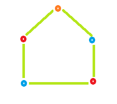
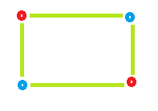

### Q2. Coloring a Cycle Graph
#### Problem Description
```text
Given the number of vertices A in a Cyclic Graph.

Your task is to determine the minimum number of colors required to color the graph so 
that no two Adjacent vertices have the same color.


A cyclic graph with A vertices is a graph with A edges, such that it forms a loop. 
See example test case explanation for more details.
```
#### Problem Constraints
<div style="background-color: #f9f9f9; padding: 5px 10px;">
    <p>3 &lt;= A &lt;= 10<sup>9</sup></p>
</div>

```text
3 <= A <= 10^9
```
#### Input Format
```text
First argument is an integer A denoting the number of vertices in the Cyclic Graph.
```
#### Output Format
```text
Return an single integer denoting the minimum number of colors required to color 
the graph so that no two Adjacent vertices have the same color.
```
#### Example Input
```text
Input 1:
 5

Input 2:
 4
```
#### Example Output
```text
Output 1:
 3

Output 2:
 2
```
#### Example Explanation
```text
Explanation 1:
```

```text
Color required = 3
```
```text
Explanation 1:
```

```text
Color required = 2
```
### Hints
* Hint 1
```text
If the no. of vertices is Even then it is Even Cycle and to color such graph we 
require 2 colors.

If the no. of vertices is Odd then it is Odd Cycle and to color such graph we 
require 3 colors.
```
* Solution Approach
```text
Cycle:- cycle is a path of edges and vertices wherein a vertex is reachable 
        from itself. or in other words, it is a Closed walk.

Even Cycle:- In which Even number of vertices is present is known as Even Cycle.

Odd Cycle:- In which Odd number of Vertices is present is known as Odd Cycle.

Approach:

    1. If the no. of vertices is Even then it is Even Cycle and to color such graph 
       we require 2 colors.
    
    2. If the no. of vertices is Odd then it is Odd Cycle and to color such graph 
       we require 3 colors.
```
* Complete Solution
* * Solution in Java
```java
public class Solution {
    public int solve(int A) {
        return Color(A);
    }
    public static int Color(int vertices) {
        int result = 0;
        // Check if number of vertices 
        // is odd or even. 
        // If number of vertices is even 
        // then color require is 2 otherwise 3 
        if (vertices % 2 == 0)
            result = 2;
        else
            result = 3;
        return result;
    }
}
```
* * Solution in Javascript
```javascript
module.exports = {
  solve: function (A) {
    if (A & 1) return 3;
    else return 2;
  },
};
```
* * Solution in C++
```cpp
int Color(int vertices) {
    int result = 0;
    // Check if number of vertices 
    // is odd or even. 
    // If number of vertices is even 
    // then color require is 2 otherwise 3 
    if (vertices % 2 == 0)
        result = 2;
    else
        result = 3;
    return result;
}
int Solution::solve(int A) {
    return Color(A);
}
```
