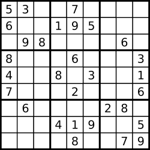

### Q7. Valid Sudoku
#### Problem Description
```text
Determine if a Sudoku is valid, according 
to: http://sudoku.com.au/TheRules.aspx

The Sudoku board could be partially filled, where empty 
cells are filled with the character '.'.
```


#### Problem Constraints
```text
Not available 
```
#### Input Format
```text
The input corresponding to the above configuration :
```
#### Output Format
```text
Return integer
```
#### Example Input
```text
Input 1:
["53..7....", "6..195...", ".98....6.", "8...6...3", 
    "4..8.3..1", "7...2...6", ".6....28.", "...419..5", "....8..79"]
```
#### Example Output
```text
Return 0 / 1 
```
#### Example Explanation
```text
A partially filled sudoku which is valid.

Note:

A valid Sudoku board (partially filled) is not necessarily 
solvable. Only the filled cells need to be validated.
Return 0 / 1 ( 0 for false, 1 for true ) for this problem
```
### Hints
* Hint 1
```text
Not available
```
* Solution Approach
```text
Very simple simulation problem. Just need to keep track of 
the digits seen in every row, every column and every block 
as defined in the rules.

Whenever you encounter a digit already seen, you know the 
sudoku is not valid.

Note that this problem will get very complicated if you were 
to determine if the sudoku was solvable.
```
* Complete Solution
* * Solution in Java
```java
public class Solution {
	public int isValidSudoku(final List<String> A) {
	    
	    if (A == null)
	        return 0;
	    
	    int n = A.size();
	    
	    if (n != 9 || A.get(0).length() != 9)
	        return 0;
	    
	    HashSet<Character> hashSet = new HashSet<>();
	    
	    for (int i = 0; i < 9; i++) {
	        hashSet.clear();
	        for (int j = 0; j < 9; j++) {
	            char c = A.get(i).charAt(j);
	            if (c == '.')
	                continue;
	            if (hashSet.contains(c))
	                return 0;
	            hashSet.add(c);
	        }
	    }
	    
	    for (int i = 0; i < 9; i++) {
	        hashSet.clear();
	        for (int j = 0; j < 9; j++) {
	            char c = A.get(j).charAt(i);
	            if (c == '.')
	                continue;
	            if (hashSet.contains(c))
	                return 0;
	            hashSet.add(c);
	        }
	    }
        
	    for (int k = 0; k < 9; k++) {
	        int x = k / 3;
	        int y = k % 3;
	        hashSet.clear();
	        for (int i = 3 * x; i < 3 * x + 3; i++) {
	            for (int j = y * 3; j < y * 3 + 3; j++) {
	                char c = A.get(j).charAt(i);
	                if (c == '.')
	                    continue;
	                if (hashSet.contains(c))
	                    return 0;
	                hashSet.add(c);
	            }
	        }
	    }
	    return 1;
	    
	}
}
```
* * Solution in Javascript
```javascript
var cellmaps = {}
var rowmaps = {}
var colmaps = {}

module.exports = {
    //param A : array of strings
    //return an integer
    isValidSudoku: function (A) {
        for (var i = 0; i < 9; i++) {
            rowmaps[i] = {}
            colmaps[i] = {}
            cellmaps[i] = {}
        }

        for (var row = 0; row < A.length; row++) {
            var r = A[row]

            for (var col = 0; col < r.length; col++) {
                var num = r[col]

                if (num === '.') continue;

                if (rowmaps[row][num]) {
                    // console.log('row', row, num, rowmaps[row][num])
                    return 0;
                } else {
                    rowmaps[row][num] = true;
                }

                if (colmaps[col][num]) {
                    // console.log('col', col, num, colmaps[col][num])
                    return 0;
                } else {
                    colmaps[col][num] = true;
                }

                var cell = Math.floor(row / 3) * 3 + Math.floor(col / 3)

                if (cellmaps[cell][num]) {
                    // console.log('cell', row, col, cell, cellmaps[cell][num])
                    return 0;
                } else {
                    cellmaps[cell][num] = true;
                }
            }
        }

        return 1;
    }
};
```
* * Solution in C++
```cpp
class Solution {
public:
    bool isValidSudoku(vector<string> &board) {
        bool r[9][9], c[9][9], s[3][3][9];
        memset(r, false, sizeof(r));
        memset(c, false, sizeof(c));
        memset(s, false, sizeof(s));
        int number;
        for (int i = 0; i < 9; i++) {
            for (int j = 0; j < 9; j++) {
                if (board[i][j] > '0' && board[i][j] <='9') {
                    number = board[i][j] - '1';
                    if (r[i][number]) return false;
                    r[i][number] = true;
                    if (c[j][number]) return false;
                    c[j][number] = true;
                    if (s[i / 3][j / 3][number]) return false;
                    s[i / 3][j / 3][number] = true;
                }
            }
        }
        return true;
    }
};
```

