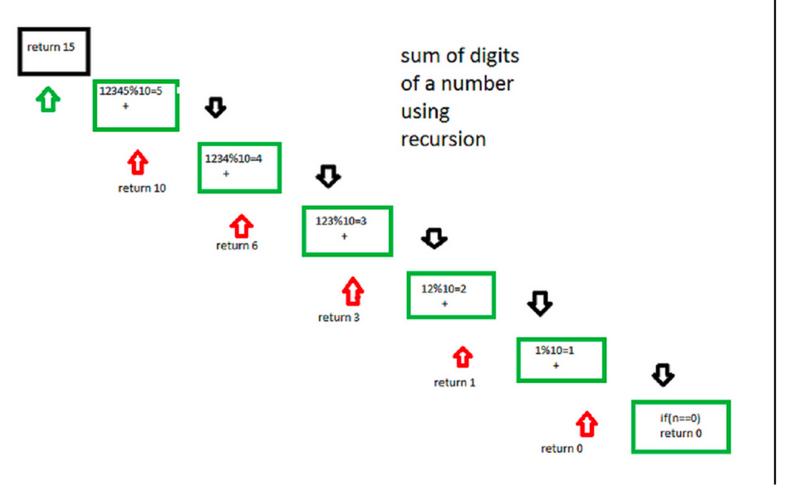

### Q2. Sum of Digits!
#### Problem Description
```text
Given a number A, we need to find the sum of its 
digits using recursion.
```
#### Problem Constraints
<div style="background-color: #f9f9f9; padding: 5px 10px;">
    <p>1 &lt;= A &lt;= 10<sup>9</sup></p>
</div>

```text
1 <= A <= 10^9
```
#### Input Format
```text
The first and only argument is an integer A.
```
#### Output Format
```text
Return an integer denoting the sum of digits of the number A.
```
#### Example Input
```text
Input 1:
 A = 46

Input 2:
 A = 11
```
#### Example Output
```text
Output 1:
 10

Output 2:
 2
```
#### Example Explanation
```text
Explanation 1:
    Sum of digits of 46 = 4 + 6 = 10

Explanation 2:
    Sum of digits of 11 = 1 + 1 = 2
```
### Hints
* Hint 1
```text
Any number can be written in the sum of the power of 10’s

For example: 123 = (1 * 100) + (2 * 10) + (3)
Similarly, 1234 = (1 * 1000) + (2 * 100) + (3 * 10) + 4

Try to use the above fact to find a solution to the problem.
```
* Solution Approach
```text
Step by step process for better understanding of how the algorithm works.
Let the number be 12345.
Step 1-> 12345 % 10 which is equal-too 5 + ( send 12345/10 to next step ),
Step 2-> 1234 % 10 which is equal-too 4 + ( send 1234/10 to next step ),
Step 3-> 123 % 10 which is equal-too 3 + ( send 123/10 to next step ),
Step 4-> 12 % 10 which is equal-too 2 + ( send 12/10 to next step ),
Step 5-> 1 % 10 which is equal-too 1 + ( send 1/10 to next step ),
Step 6-> 0 algorithm stops.
Following diagram will illustrate the process of recursion.
```


* Complete Solution
* * Solution in Java
```java
public class Solution {
    public int solve(int A) {
        return sum_of_digit(A);
    }
    static int sum_of_digit(int n) {  
        if (n == 0) 
            return 0; 
        return (n % 10 + sum_of_digit(n / 10)); 
    }
}
```
* * Solution in Javascript
```javascript
module.exports = { 
    //param A : integer
    //return an integer
    solve : function(A) {
       function sumdigit(n) {
           if( n == 0 )
           return 0;
           let dig = n % 10;
       
           return dig + sumdigit(Math.floor(n/10));
       }
       return sumdigit(A);
    }
};
```
* * Solution in C++
```cpp
int sum_of_digit(int n)
{
    if (n == 0)
    return 0;
    return (n % 10 + sum_of_digit(n / 10));
}
int Solution::solve(int A) {
    return sum_of_digit(A);
}
```

