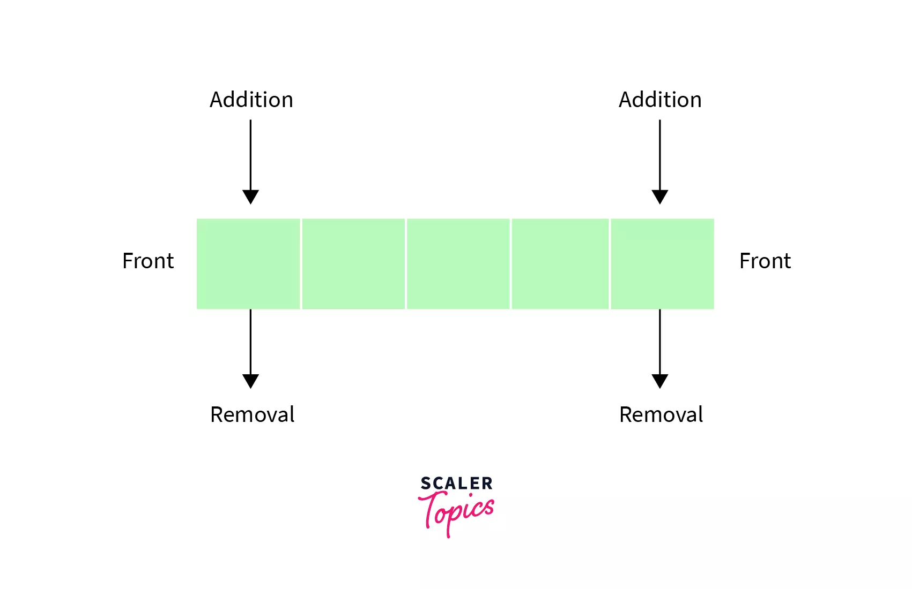
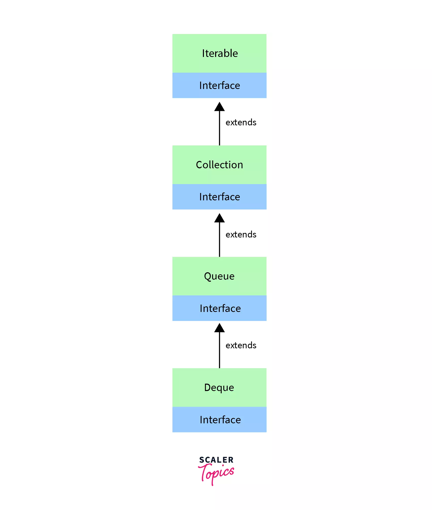

## Deque in Java
### Overview
```text
Deque in Java is a subtype of the Queue interface in java.util package. 
It supports a linear data structure that allows insertion and 
deletion of elements at both ends. It can be used both as a queue 
(FIFO policy) and as a stack (LIFO policy). 
Deque is an acronym for double-ended queue.
```
### Introduction
```text
Consider a real-world scenario where people are standing in a queue in a bank. Ideally, a person:
    
    * joins the queue from the end and
    * leaves from the front or the end
    
In some scenarios, a person who just left the queue can have some 
clarifications and may need to join the queue directly from the front. 
This is a special case where we allow people to join the queue from 
the front. This is one of the real-time examples of deque where we 
allow people to join and leave from both ends of the queue.
```
### Deque Interface
```text
Deque in Java is an interface, and it belongs to the java.util package. 
It is a subtype of the Queue interface. Deque stands for double-ended 
queue because it allows retrieval, addition, and removal from both ends. 
Hence it can be used as a 
Stack (Last-In-First-Out) or a Queue (First-In-First-Out). 
Deque in Java is an extension of the Queue interface.
```

### Syntax:
```text
Deque<T> deq = new Deque<T>();
```
```text
Deque extends the Queue interface, allowing addition to the end and 
removal from the front. Queue extends Collection interface. 
The Collection interface extends the Iterable interface, 
making all the collections iterable.
```
### Declaration:
```text
public interface Deque extends Queue
```

### Example
```text
Now let's apply Deque in Palindrome Checker. A palindrome is a 
sequence of characters that reads the same forward or backward. 
The characters are first added to the deque, and the characters 
from the front and the rear are repeatedly removed and compared 
to see if they are equal. If they are not equal, it is not a palindrome. 
If they are equal for all iterations, it is a palindrome.
```
```java
import java.util.ArrayDeque;
import java.util.Deque;

class Main {
    public static boolean isPalindrome(String input) {
        Deque<Character> deque = new ArrayDeque<>();
        // Initializing the deque
        for (Character c: input.toCharArray()) {
            deque.add(c);
        }
        while (deque.size() > 1) {
            Character front = deque.removeFirst();
            Character rear = deque.removeLast();
            if (front != rear) return false;
        }
        return true;
    }
    public static void main(String[] args) {
        System.out.println(isPalindrome("madam"));
        System.out.println(isPalindrome("cacc"));
    }
}
```
### Output:
```text
true
false
```

### Explanation:
```text
1. We first initialized the deque with the characters of the string.
2. We repeatedly remove and compare the first and last values of 
    the deque and check if they are equal.
3. If they are not equal, we return false; we repeat step 2 until 
    the deque has more than one value.
```
### Creating Deque Objects
```text
A Deque in Java can be created by creating objects of the classes 
that implement the Deque interface. ArrayDeque and LinkedList are 
the commonly used Deque implementations.
```
### Example:
```java
import java.util.ArrayDeque;
import java.util.Deque;
import java.util.LinkedList;

class Main {
    public static void main(String[] args) {
        Deque<Object> arrayDeque = new ArrayDeque<>();
        Deque<Integer> linkedDeque = new LinkedList<>();
    }
}
```

```text
When we create Deque objects, we can specify the type of objects that 
can be stored in the deque. This type of restriction can be 
achieved by the Generics concept in Java.
```
### Example
```text
    * Deque<Integer> - Stores only Integer values.
    * Deque<Student> - Stores only Student objects.
    * Deque<Object> - Stores any objects.
```
### Methods of Deque Interface
```text
Deque in Java offers several methods to add, remove and retrieve elements from the Deque.
```

