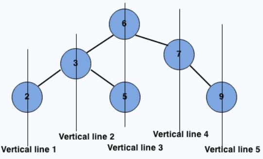

### Q2. Vertical Order traversal
#### Problem Description
```text
Given a binary tree, return a 2-D array with vertical order traversal of it. Go through 
the example and image for more details.
```

```text
NOTE: If 2 Tree Nodes shares the same vertical level then the one with lesser depth 
will come first.
```
#### Problem Constraints
<div style="background-color: #f9f9f9; padding: 5px 10px;">
    <p>0 &lt;= number of nodes &lt;= 10<sup>5</sup></p>
</div>

```text
0 <= number of nodes <= 10^5
```
#### Input Format
```text
First and only argument is a pointer to the root node of binary tree, A.
```
#### Output Format
```text
Return a 2D array denoting the vertical order traversal of tree as shown.
```
#### Example Input
```text
Input 1:

      6
    /   \
   3     7
  / \     \
 2   5     9

Input 2:

      1
    /   \
   3     7
  /       \
 2         9
```
#### Example Output
```text
Output 1:

 [
    [2],
    [3],
    [6, 5],
    [7],
    [9]
 ]

Output 2:

 [
    [2],
    [3],
    [1],
    [7],
    [9]
 ]
```
#### Example Explanation
```text
Explanation 1:
    First row represent the vertical line 1 and so on.
```
### Hints
* Hint 1
```text
The idea is to traverse the tree once and get the minimum and maximum horizontal 
distance concerning the root. For the tree shown above, the minimum distance 
is -2 (for a node with a value of 2), and the maximum distance is 2 (For a node 
with a value of 9).

Once we have maximum and minimum distances from the root, we iterate for each 
vertical line at a distance minimum to the maximum from the root. For each 
vertical line, traverse the tree and print the nodes on that vertical line.

Time Complexity: The time complexity of the above algorithm is O(w*n), where w is 
the width of the Binary Tree and n is the number of nodes in the Binary Tree. In the 
worst case, the value of w can be O(n) (consider a complete tree, for example), and 
time complexity can become O(n^2).

This problem can be solved more efficiently.
```
* Solution Approach
```text
We have discussed an O(n^2) solution in the previous hint. An efficient solution 
based on a hash map is discussed.

We need to check the Horizontal Distances from the root for all nodes. If two nodes 
have the same Horizontal Distance (HD), then they are on the same vertical line. 
The idea of HD is simple. HD for root is 0, a right edge (edge connecting to right 
subtree) is considered as +1 horizontal distance, and a left edge is considered 
as -1 horizontal distance. For example, in the above tree, HD for Node 2 is 
at -2, HD for Node 3 is -1, HD for 5 is 0, HD for node 7 is +1 and for node 9 is +2.

We can do level order traversal of the given Binary Tree.

While traversing the tree, we can maintain HDs.

We initially pass the horizontal distance as 0 for root.

For the left subtree, we pass the Horizontal Distance as the Horizontal distance of 
root minus 1.

For the right subtree, we pass the Horizontal Distance as the Horizontal Distance 
of root plus 1.

For every HD value, we maintain a list of nodes in a hasp map. Whenever we see a 
node in traversal, we go to the hash map entry and add the node to the hash map 
using HD as a key in a map.

The Time Complexity of a hashing-based solution can be considered as O(n) under 
the assumption that we have a good hashing function that allows insertion and 
retrieval operations in O(1) time.
```
* Complete Solution
* * Solution in Java
```java
/**
 * Definition for binary tree
 * class TreeNode {
 * int val;
 * TreeNode left;
 * TreeNode right;
 * TreeNode(int x) { val = x; }
 * }
 */
public class Solution {
    static class Pair {
        TreeNode t;
        int x;

        Pair(TreeNode t, int x) {
            this.t = t;
            this.x = x;
        }
    }

    public ArrayList<ArrayList<Integer>> verticalOrderTraversal(TreeNode root) {
        ArrayList<ArrayList<Integer>> ans = new ArrayList<>();

        ArrayList<Integer> ar = new ArrayList<>();
        if (root == null) {
            return ans;
        }

        TreeMap<Integer, ArrayList<Integer>> tm = new TreeMap<>();
        Queue<Pair> q = new LinkedList<>();
        q.add(new Pair(root, 0));

        while (!q.isEmpty()) {
            Pair p = q.poll();
            int v = p.t.val;
            int x = p.x;
            ar = new ArrayList<>();
            if (tm.containsKey(x)) {
                ar = tm.get(x);
                ar.add(v);
            } else {
                ar.add(v);
            }

            tm.put(x, ar);
            if (p.t.left != null) {
                q.add(new Pair(p.t.left, x - 1));
            }
            if (p.t.right != null) {
                q.add(new Pair(p.t.right, x + 1));
            }
        }
        for (int x : tm.keySet()) {
            ArrayList<Integer> f = tm.get(x);
            ans.add(f);
        }
        return ans;
    }
}
```
* * Solution in Javascript
```javascript
// Definition for a  binary tree node
//    function TreeNode(data){
//      this.data = data
//      this.left = null
//      this.right = null
//    }

module.exports = {
    //param A : root node of tree
    //return a array of array of integers
    verticalOrderTraversal: function (A) {
        if (!A) {
            return [[]];
        }
        let m = {};
        let q = [], result = [];
        q.push([A, 0]);
        let min_dist = 0, max_dist = 0;
        while (q.length > 0) {
            let front = q.shift();

            let currentHorizontalDistance = front[1];
            // Maintain minimum and maximum horizontal Distance
            min_dist = Math.min(min_dist, currentHorizontalDistance);
            max_dist = Math.max(max_dist, currentHorizontalDistance);
            let currentTreeNode = front[0];

            if (!m[currentHorizontalDistance]) {
                m[currentHorizontalDistance] = [];
                m[currentHorizontalDistance].push(currentTreeNode.data);
            } else {
                m[currentHorizontalDistance].push(currentTreeNode.data);
            }
            if (currentTreeNode.left != null) {
                q.push([currentTreeNode.left, currentHorizontalDistance - 1]);

            }
            if (currentTreeNode.right != null) {
                q.push([currentTreeNode.right, currentHorizontalDistance + 1]);
            }
        }
        for (let obj in m) {
            result.push([obj, m[obj]]);
        }
        let ans = [];
        result.sort(function (a, b) {
            return a[0] - b[0];
        });
        for (let i = 0; i < result.length; i++) {
            ans.push(result[i][1]);
        }
        return ans;
    }
};
```
* * Solution in C++
```cpp
/**
 * Definition for binary tree
 * struct TreeNode {
 *     int val;
 *     TreeNode *left;
 *     TreeNode *right;
 *     TreeNode(int x) : val(x), left(NULL), right(NULL) {}
 * };
 */
vector < vector < int > > Solution::verticalOrderTraversal(TreeNode * A) {
    vector < vector < int > > result;
    // Base case
    if (!A) return result;
    // Create a Hash map of horizontalDistance, ListOfTreeNodes(at that horizontalDistance)
    unordered_map < int, vector < int > > m;

    // Create queue to do level order traversal.
    // Every item of queue contains node and horizontal distance.
    queue < pair < TreeNode * , int > > q;
    q.push(make_pair(A, 0)); // root's horizontalDistance is zero
    int min_dist = 0, max_dist = 0;
    while (!q.empty()) {
        // get the queue front
        pair < TreeNode * , int > front = q.front();
        q.pop();
        int currentHorizontalDistance = front.second;
        // Maintain minimum and maximum horizontal Distance
        min_dist = min(min_dist, currentHorizontalDistance);
        max_dist = max(max_dist, currentHorizontalDistance);
        TreeNode * currentTreeNode = front.first;

        // insert current node to hash map
        m[currentHorizontalDistance].push_back(currentTreeNode -> val);

        if (currentTreeNode -> left != NULL) {
            q.push(make_pair(currentTreeNode -> left, currentHorizontalDistance - 1));

        }
        if (currentTreeNode -> right != NULL) {
            q.push(make_pair(currentTreeNode -> right, currentHorizontalDistance + 1));
        }
    }
    // Traverse the map and print nodes at every horigontal distance
    for (int i = min_dist; i <= max_dist; i++) {
        result.push_back(m[i]);
    }
    return result;
}
```

