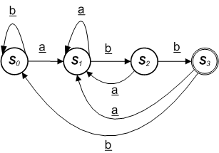

### Q2. Regular Expression II
#### Problem Description
```text
Implement wildcard pattern matching with support for ' ? ' and ' * ' for strings A and B.

    * ' . ' : Matches any single character.
    * ' * ' : Matches zero or more of the preceding element.

The matching should cover the entire input string (not partial).
```
#### Problem Constraints
<div style="background-color: #f9f9f9; padding: 5px 10px;">
    <p>1 &lt;= length(A), length(B) &lt;= 10<sup>4</sup></p>
</div>

```text
1 <= length(A), length(B) <= 10^4
```
#### Input Format
```text
The first argument of input contains a string A.
The second argument of input contains a string B denoting the pattern.
```
#### Output Format
```text
Return 1 if the patterns match else return 0.
```
#### Example Input
```text
Input 1:
 A = "aab"
 B = "c*a*b"

Input 2:
 A = "acz"
 B = "a.a"
```
#### Example Output
```text
Output 1:
 1

Output 2:
 0
```
#### Example Explanation
```text
Explanation 1:
    'c' can be repeated 0 times, 'a' can be repeated 1 time. Therefore, it matches "aab".
    So, return 1.

Explanation 2:
    '.' matches any single character. First two character in string A will be match. 
    But the last character i.e 'z' != 'a'. Return 0.
```
### Hints
* Hint 1
```text
It might seem deceptively easy even you know the general idea, but programming it 
correctly with all the details require careful thought.

Think carefully how you would do matching of ‘’. Please note that ‘’ in regular 
expression is different from wildcard matching, as we match the previous 
character 0 or more times. But, how many times? If you are stuck, recursion is your friend.

This problem is a tricky one. Due to the huge number of edge cases, many people 
would write lengthy code and have numerous bugs on their first try. Try your best 
getting your code correct first, then refactor mercilessly to as clean and 
concise as possible!
```
* Solution Approach


```text
This looks just like a straight forward string matching, isn’t it? couldn't we just match 
the pattern and the input string character by character? The question is, 
how to match a '*' ?

A natural way is to use a greedy approach; that is, we attempt to match the previous 
character as many as we can. Does this work? Let us look at some examples.

    s = “abbbc”
    p = “ab*c”

Assume we have matched the first ‘a’ on both s and p. When we see "b*" in p, we 
skip all b’s in s. Since the last ‘c’ matches on both side, they both match.

s = “ac”
p = “ab*c”

After the first ‘a’, we see that there is no b’s to skip for “b*”. We match the 
last ‘c’ on both side and conclude that they both match.

It seems that being greedy is good. But how about this case?

s = “abbc”
p = “ab*bbc”

When we see “b*” in p, we would have skip all b’s in s. They both should match, but 
we have no more b’s to match. Therefore, the greedy approach fails in the above case.

One might be tempted to think of a quick workaround. How about counting the number 
of consecutive b’s in s? If it is smaller or equal to the number of 
consecutive b’s after “b*” in p, we conclude they both match and continue from 
there. For the opposite, we conclude there is not a match.

This seem to solve the above problem, but how about this case:

s = “abcbcd” 
p = “a.*c.*d”

Here, “.*” in p means repeat ‘.’ 0 or more times. Since ‘.’ can match any 
character, it is not clear how many times ‘.’ should be repeated. Should 
the ‘c’ in p matches the first or second ‘c’ in s? Unfortunately, there 
is no way to tell without using some kind of exhaustive search.

We need some kind of backtracking mechanism such that when a matching fails, we return 
to the last successful matching state and attempt to match more characters 
in s with ‘*’. This approach leads naturally to recursion.

The recursion mainly breaks down elegantly to the following two cases:

    1. If the next character of p is NOT ‘*’, then it must match the current 
       character of s. Continue pattern matching with the next character of both s and p.
    2. If the next character of p is ‘*’, then we do a brute force exhaustive 
       matching of 0, 1, or more repeats of current character of p… Until we could 
       not match any more characters.

You would need to consider the base case carefully too. That would be left as an 
exercise to the reader. :)
```
* Complete Solution
* * Solution in Java
```java
public class Solution {
    public int isMatch(final String s, final String p) {
        boolean[][] d = new boolean[s.length() + 1][p.length() + 1];
        d[0][0] = true;
        for (int i = 0; i < p.length(); ++i) {
            char current = p.charAt(i);
            if (current == '*') {
                for (int j = 0; j < s.length(); ++j) {
                    d[j + 1][i + 1] = d[j + 1][i - 1];
                }
                for (int j = 0; j < s.length(); ++j) {
                    if ((p.charAt(i - 1) == '.') || (p.charAt(i - 1) == s.charAt(j))) {
                        d[j + 1][i + 1] = d[j + 1][i + 1] || d[j][i - 1] || d[j][i + 1];
                    }
                }
            } else if (current == '.') {
                for (int j = s.length() - 1; j >= 0; --j) {
                    d[j + 1][i + 1] = d[j][i];
                }
            } else {
                for (int j = 0; j < s.length(); ++j) {
                    if (s.charAt(j) == p.charAt(i)) {
                        d[j + 1][i + 1] = d[j][i];
                    }
                }
            }
        }
        return d[s.length()][p.length()] ? 1 : 0;
    }
}
```
* * Solution in Javascript
```javascript
module.exports = {
    //param A : string
    //param B : string
    //return an integer
    isMatch: function (s, p) {
        let d = new Array(s.length + 1);
        for (let i = 0; i < s.length + 1; i++) {
            d[i] = new Array(p.length + 1);
        }
        d[0][0] = true;
        for (let i = 0; i < p.length; ++i) {
            let current = p.charAt(i);
            if (current == '*') {
                for (let j = 0; j < s.length; ++j) {
                    d[j + 1][i + 1] = d[j + 1][i - 1];
                }
                for (let j = 0; j < s.length; ++j) {
                    if ((p.charAt(i - 1) == '.') || (p.charAt(i - 1) == s.charAt(j))) {
                        d[j + 1][i + 1] = d[j + 1][i + 1] || d[j][i - 1] || d[j][i + 1];
                    }
                }
            } else if (current == '.') {
                for (let j = s.length - 1; j >= 0; --j) {
                    d[j + 1][i + 1] = d[j][i];
                }
            } else {
                for (let j = 0; j < s.length; ++j) {
                    if (s.charAt(j) == p.charAt(i)) {
                        d[j + 1][i + 1] = d[j][i];
                    }
                }
            }
        }
        return d[s.length][p.length] ? 1 : 0;
    }
};
```
* * Solution in C++
```cpp
int Solution::isMatch(const string A,
    const string B) {
    int la = A.length();
    int lb = B.length();
    vector < vector < int > > dp(la + 1, vector < int > (lb + 1, 0));
    for (int i = 0; i < la + 1; i++) {
        for (int j = 0; j < lb + 1; j++) {
            if (i == 0 && j == 0) {
                dp[i][j] = 1;
            } else if (j == 0) {
                dp[i][j] = 0;
            } else if (i == 0) {
                if (B[j - 1] == '*') {
                    dp[i][j] = dp[i][j - 2];
                }
            } else {
                if (A[i - 1] == B[j - 1] || B[j - 1] == '.') {
                    dp[i][j] = dp[i - 1][j - 1];
                } else if (B[j - 1] == '*') {
                    dp[i][j] = dp[i][j - 2];
                    if (A[i - 1] == B[j - 2] || B[j - 2] == '.') {
                        dp[i][j] = dp[i][j] || dp[i - 1][j];
                    }
                } else {
                    dp[i][j] = 0;
                }
            }
        }
    }
    return dp[la][lb];
}
```

