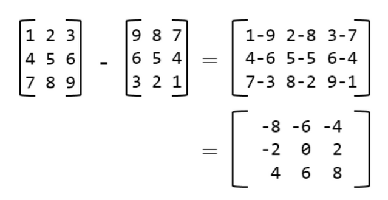

### Q4. Matrix Subtraction
#### Problem Description
```text
You are given two integer matrices A and B having same size(Both having 
same number of rows (N) and columns (M). You have to subtract 
matrix B from A and return the resultant matrix. 
(i.e. return the matrix A - B).

If A and B are two matrices of the same order (same dimensions). Then A - B 
is a matrix of the same order as A and B and its elements are obtained 
by doing an element wise subtraction of A from B.
```
#### Problem Constraints
<div style="background-color: #f9f9f9; padding: 5px 10px;">
    <p>1 &lt;= <strong>N, M</strong> &lt;= 10<sup>3</sup></p>
    <p>-10<sup>9</sup> &lt;= <strong>A[i][j], B[i][j]</strong> &lt;= 10<sup>9</sup></p>
</div>

```text
1 <= N, M <= 10^3

-10^9 <= A[i][j], B[i][j] <= 10^9
```
#### Input Format
```text
The first argument is the 2D integer array A
The second argument is the 2D integer array B
```
#### Output Format
```text
Return a 2D matrix denoting A - B.
```
#### Example Input
```text
Input 1:
    A =  [[1, 2, 3], 
          [4, 5, 6], 
          [7, 8, 9]]

    B =  [[9, 8, 7], 
          [6, 5, 4], 
          [3, 2, 1]]
          
Input 2:
    A = [[1, 1]]
     
    B = [[2, 3]] 
```
#### Example Output
```text
Output 1:
     [[-8, -6, -4],
      [-2, 0, 2],
      [4, 6, 8]]

Output 2:
     [[-1, -2]]
```
#### Example Explanation
```text
Explanation 1:
```

```text
Explanation 2:

 [[1, 1]] - [[2, 3]] = [[1 - 2, 1 - 3]] = [[-1, -2]]
```

### Hints
* Hint 1
```text
You need at least two indices to access an element from a 2D matrix.

To access an element in the ith row and the jth column you will need to 
index your matrix like A[i][j].
```
* Solution Approach
```text
To subtract the two given matrices we have to subtract their corresponding 
elements. For example, C[i][j] = A[i][j] - B[i][j].

Traverse both matrices row wise(first all elements of a row, then jump to 
next row) using two nested loops.

For every element A[i][j], subtract it with corresponding element B[i][j] and 
store the result in difference matrix at C[i][j].
```
* Complete Solution
* * Solution in Java
```java
public class Solution {
    public int[][] solve(int[][] A, int[][] B) {
        int N = A.length;
        int M = A[0].length;

        int[][] C = new int[N][M];
        // Iterating over the rows
        for (int i = 0; i < N; i++) {
            // Iterating over the columns
            for (int j = 0; j < M; j++) {
                C[i][j] = A[i][j] - B[i][j];
            }
        }
        return C;
    }
}
```
* * Solution in Javascript
```javascript
module.exports = {
    //param A : array of array of integers
    //param B : array of array of integers
    //return a array of array of integers
    solve: function (A, B) {
        let n = A.length;
        let m = A[0].length;

        let ans = new Array(n);

        for (let i = 0; i < n; i++) {
            ans[i] = [];
        }
        // Iterating over the rows
        for (let i = 0; i < n; i++) {
            // Iterating over the columns
            for (let j = 0; j < m; j++) {
                ans[i][j] = A[i][j] - B[i][j];
            }
        }
        return ans;
    }
};
```
* * Solution in C++
```cpp
vector<vector<int> > Solution::solve(vector<vector<int> > &A, vector<vector<int> > &B) {
    int N = A.size();
    int M = A[0].size();

    vector<vector<int>> C(N, vector<int>(M));
    // Iterating over the rows
    for (int i = 0; i < N;i++) {
        // Iterating over the columns
        for (int j = 0; j < M;j++) {
            C[i][j] = A[i][j] - B[i][j];
        }
    }
    return C;
}
```

