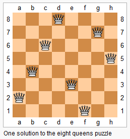

### Q1. NQueens
#### Problem Description
```text
The n-queens puzzle is the problem of placing n queens on an n×n chessboard such 
that no two queens attack each other.
```

```text
Given an integer A, return all distinct solutions to the n-queens puzzle.

Each solution contains a distinct board configuration of the n-queens' placement, 
where 'Q' and '.' both indicate a queen and an empty space respectively.

The final list should be generated in such a way that the indices of the queens 
in each list should be in reverse lexicographical order.
```
#### Problem Constraints
```text
1 <= A <= 10
```
#### Input Format
```text
First argument is an integer n denoting the size of chessboard
```
#### Output Format
```text
Return an array consisting of all distinct solutions in which each element is a 
2d char array representing a unique solution.
```
#### Example Input
```text
Input 1:
 A = 4

Input 2:
 A = 1
```
#### Example Output
```text
Output 1:
 [
  [".Q..",  // Solution 1
   "...Q",
   "Q...",
   "..Q."], 

  ["..Q.",  // Solution 2
   "Q...",
   "...Q",
   ".Q.."]
 ]

Output 1:
 [
  [Q]
 ]
```
#### Example Explanation
```text
Explanation 1:
    There exist only two distinct solutions to the 4-queens puzzle:

Explanation 1:
    There exist only one distinct solutions to the 1-queens puzzle:
```
### Hints
* Hint 1
```text
Unfortunately, there is no magic trick to solve this problem. This is more 
of a bruteforce problem. A more intelligent bruteforce.

Think recursively. Store which places are occupied already and move on to 
next row and fill in either of the available positions and go on.
```
* Solution Approach
```text
Notes :
    1) There can exactly be one queen per row. Otherwise the 2 queens in the row would 
       collide. If you miss out on a row, there cannot be N queens on the board.
    2) Every column needs to have exactly one queen.
    3) The left diagonal cannot have more than one queen ( Unique (row + col) )
    4) The right diagonal cannot have more than one queen ( Unique (row - col) )

We can start placing a queen per row. When placing a queen on a row, col, we need 
to check if the position is available based on what we have already placed. Then we 
move to the next row.
```
* Complete Solution
* * Solution in Java
```java
public class Solution {
    ArrayList<ArrayList<String>> res;
    ArrayList<Integer> mRow;
    ArrayList<Integer> mCol;
    char board[][];
    int N;
    
    public ArrayList<ArrayList<String>> solveNQueens(int A) {
        res = new ArrayList<>();
        N = A;
        board = new char[N][N];
        mRow = new ArrayList<>();
        mCol = new ArrayList<>();
        for (int i = 0; i < N; i++)
            Arrays.fill(board[i], '.');
        backtrack(0);
        return res;
    }
    
    public void backtrack(int row) {
        if (row == N) {
            addState();
            return;
        }
        for (int i = 0; i < N; i++) {
            board[row][i] = 'Q';
            mRow.add(row);
            mCol.add(i);
            if (validState()) {
                backtrack(row + 1);
            }
            mRow.remove(mRow.size() - 1);
            mCol.remove(mCol.size() - 1);
            board[row][i] = '.';
        }
    }
    
    private boolean validState() {
       // check if the current arrangement is valid
        int row, col;
        int nextRow, nextCol;
        for (int i = 0; i < mRow.size(); i++) {
            row = mRow.get(i);
            col = mCol.get(i);
            for (int j = i + 1; j < mRow.size(); j++) {
                nextRow = mRow.get(j);
                nextCol = mCol.get(j);
                if (row == nextRow || col == nextCol)
                    return false;
                if (Math.abs(row - nextRow) == Math.abs(col - nextCol))
                    return false;
            }
        }
        return true;
    }
    
    private void addState() {
        ArrayList<String> state = new ArrayList<>();
        for (int i = 0; i < N; i++) {
            state.add(new String(board[i]));
        }
        res.add(state);
    }
}
```
* * Solution in Javascript
```javascript
module.exports = { 
    //param A : integer 
    //return a array of array of integers 
    solveNQueens : function(A){ 
        if(A === 1) 
        return ['Q']; 
        var globalAns = []; 
        var ans = []; 
        for(var i = 0; i < A; i++) { 
            var temp = ''; 
            for(var j = 0; j < A; j++) { 
                temp += '.'; 
            } 
            ans.push(temp); 
            
        } 
        var row = 0; 
        solveNQueens(A, row, globalAns, ans); 
        return globalAns.reverse(); 
        function solveNQueens(n, row, globalAns, ans) { 
            if(n === row) { 
                var aa = [...ans]; 
                globalAns.push(aa); 
                return; 
                
            } 
            for( var i = 0; i < n; i++) { 
                if(isSafe(n, ans, row, i)) { 
                    ans[row] = ans[row].split(''); 
                    ans[row].splice(i, 1, 'Q'); 
                    ans[row] = ans[row].join(''); 
                    solveNQueens(n, row + 1, globalAns, ans); 
                    ans[row] = ans[row].split(''); 
                    ans[row].splice(i, 1, '.'); 
                    ans[row] = ans[row].join(''); 
                } 
                
            } 
            
        } 
        function isSafe(n, ans, row, col) { 
            // check if the current arrangement is valid
            for(var i = 0 ; i < row; i++) { 
                if(ans[i][col] === 'Q') 
                return false; 
                
            } 
            for(var i = row, j = col; i >= 0 && j >= 0; i--,j--) { 
                if(ans[i][j] === 'Q') 
                return false; 
                
            } 
            for(var i = row, j = col; i >=0 && j < n; i--, j++) { 
                if(ans[i][j] === 'Q') 
                return false; 
                
            } 
            return true; 
        } 
    } 
};
```
* * Solution in C++
```cpp
bool isAvailable(const vector<int> &solution, int i, int j) {
    for (int k = 0; k < i; ++k) {
        if (j == solution[k] || i + j == k + solution[k] || i - j == k - solution[k]) return false;
    }
    return true;
}

vector<string> solToStrings(const vector<int>& sol) {
    int n = sol.size();
    vector<string> sol_strings(n);
    for (int i = 0; i < n; ++i) {
        sol_strings[i] = string(n, '.');
        sol_strings[i][sol[i]] = 'Q';
    }
    return sol_strings;
}

void solveNQueensImpl(int row, vector<int> &solution, vector<vector<string> > &solutions) {
    int n = solution.size();
    if (row == n) {
        solutions.push_back(solToStrings(solution));
        return;
    }
    // Traverse for each column
    for (int j = 0; j < n; ++j) {
        // Check if there is another queen in this column or diagonals
        if (isAvailable(solution, row, j)) {
            solution[row] = j;
            solveNQueensImpl(row + 1, solution, solutions);
        }
    }
}

vector<vector<string> > Solution::solveNQueens(int n) {
    // Do not write main() function.
    // Do not read input, instead use the arguments to the function.
    // Do not print the output, instead return values as specified
    // Still have a doubt. Checkout www.interviewbit.com/pages/sample_codes/ for more details
    
    vector<vector<string> > solutions;
    vector<int> solution(n);
    solveNQueensImpl(0, solution, solutions);
    return solutions;
}
```

